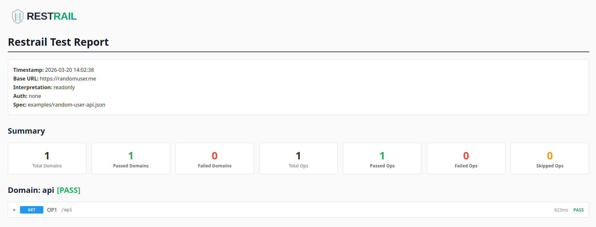

**Guardrailing your REST-Endpoints from development to production.**

Restrail automatically generates and runs integration tests for your REST API by reading your OpenAPI spec — no test code to write. Ship generated APIs to production with confidence by wiring Restrail into your CI pipeline alongside your service.

---

## What it does

Given an OpenAPI spec, Restrail:

1. **Generates** HTTP request files and an execution plan tailored to your API's shape
2. **Runs** a full CRUD cycle against a live instance — create, read, update, delete — per domain
3. **Reports** results as JSON, Markdown, or HTML — ready for your pipeline artifacts

It detects foreign key relationships between resources automatically, orders operations to satisfy dependencies, and tears down created data in reverse order. No mocking — every assertion hits a real running service.

---

## Requirements

- An OpenAPI 3.x spec (JSON format)
- A running instance of the API (with a database/persistence backend)
- JSON request/response bodies

---

## Installation

Download the latest binary for your platform from the [GitHub Releases page](../../releases/latest):

| Platform       | Binary                         |
|----------------|--------------------------------|
| Linux x86-64   | `restrail-linux-amd64`         |
| Linux ARM64    | `restrail-linux-arm64`         |
| macOS x86-64   | `restrail-darwin-amd64`        |
| macOS ARM64    | `restrail-darwin-arm64`        |
| Windows x86-64 | `restrail-windows-amd64.exe`   |

```bash
# Example: Linux x86-64
curl -L https://github.com/Joel-Haeberli/restrail/releases/latest/download/restrail-linux-amd64 \
  -o /usr/local/bin/restrail
chmod +x /usr/local/bin/restrail
```

Or build from source (requires Go):

```bash
make build
```

---

## Quick Start

### Step 1 — Discover which profile matches your API

```bash
RESTRAIL_SPEC=openapi.json restrail discover-profile
```

This reads your spec and tells you which profile best matches your endpoint patterns (see [Profiles](#profiles) below).

### Step 2 — Generate test artifacts

Create an init config:

```json
{
  "spec": "openapi.json",
  "profile": "strict",
  "output_dir": "restrail-tests"
}
```

Then run:

```bash
restrail -f init.json init
```

This produces a `restrail-tests/` folder containing:
- One `.request` file per API operation (plain HTTP, editable)
- An `execution.plan` describing run order and dependency annotations
- A `restrail_run_config.json` template to fill in with your base URL and credentials

### Step 3 — Run the tests

Fill in the generated `restrail_run_config.json`:

```json
{
  "base_url": "http://localhost:8080",
  "test_dir": "restrail-tests",
  "auth_type": "oauth2",
  "token_url": "https://auth.example.com/token",
  "creds_client_id": "my-client",
  "creds_client_secret": "my-secret"
}
```

Then run:

```bash
restrail -f restrail-tests/restrail_run_config.json run --format json,html
```

Exit code `0` = all passed. Exit code `1` = at least one failure.

### One-shot (init + run)

```bash
restrail -f run.json -i init.json run --format json
```

Runs init and immediately executes — useful for ephemeral CI environments where you don't need to commit the generated artifacts.

---

## CI/CD Integration

### GitHub Actions

Spin up your service as a job dependency, then run Restrail against it. The binary is downloaded directly from GitHub Releases.

```yaml
jobs:
  integration-test:
    runs-on: ubuntu-latest
    needs: deploy-staging       # or however you start your service

    steps:
      - uses: actions/checkout@v4

      - name: Download Restrail
        run: |
          curl -sSL https://github.com/Joel-Haeberli/restrail/releases/latest/download/restrail-linux-amd64 \
            -o /usr/local/bin/restrail
          chmod +x /usr/local/bin/restrail

      - name: Run Restrail
        env:
          RESTRAIL_BASE_URL: ${{ secrets.API_BASE_URL }}
          RESTRAIL_CREDS_CLIENT_ID: ${{ secrets.API_CLIENT_ID }}
          RESTRAIL_CREDS_CLIENT_SECRET: ${{ secrets.API_CLIENT_SECRET }}
        run: |
          restrail -f init.json -i init.json run --format json,html

      - name: Upload report
        if: always()
        uses: actions/upload-artifact@v4
        with:
          name: restrail-report
          path: results.*
```

Store your init config (`init.json`) in version control. Credentials go in repository secrets.

### GitLab CI

```yaml
restrail:
  stage: integration
  image: ubuntu:latest
  before_script:
    - curl -sSL https://github.com/Joel-Haeberli/restrail/releases/latest/download/restrail-linux-amd64
        -o /usr/local/bin/restrail
    - chmod +x /usr/local/bin/restrail
  script:
    - restrail -f init.json init
    - restrail -f restrail-tests/restrail_run_config.json run --format json,html
  artifacts:
    when: always
    paths:
      - results.*
  variables:
    RESTRAIL_BASE_URL: $API_BASE_URL
    RESTRAIL_CREDS_CLIENT_ID: $API_CLIENT_ID
    RESTRAIL_CREDS_CLIENT_SECRET: $API_CLIENT_SECRET
```

### Skipping domains in CI

If certain domains are unavailable or not relevant in a specific pipeline stage, exclude them without modifying the generated artifacts:

```bash
RESTRAIL_BLOCKED_DOMAINS=notifications,audit-log restrail -f run.json run
```

Or in the run config:

```json
{
  "blocked_domains": ["notifications", "audit-log"]
}
```

Blocked domains appear as skipped (not failed) in the report.

---

## Profiles

A profile defines the expected CRUD semantics of your API's endpoints. Restrail matches spec paths against the profile's operation patterns to determine what to test and in what order.

| Profile      | Operations tested                           | Use when your API...                                      |
|--------------|---------------------------------------------|-----------------------------------------------------------|
| `strict`     | POST, PUT (by ID), GET list, GET by ID, DELETE | Uses `PUT /resource/{id}` for full replacement          |
| `ddd`        | POST, PUT (collection), GET list, GET by ID, DELETE | Uses `PUT /resource` (no ID in path) for updates  |
| `patchwork`  | POST, PATCH (by ID), GET list, GET by ID, DELETE | Uses `PATCH` for partial updates                   |
| `appendonly` | POST, GET list, GET by ID                   | Resources are created and read but never modified/deleted |
| `readonly`   | GET list, GET by ID (optional)              | Read-only endpoints (e.g., reference data, lookups)       |

Use `restrail discover-profile` to auto-detect the best match.

Optional operations (marked `[OP]` in the profile) are run if present in the spec and skipped if absent — no failure.

---

## Configuration Reference

### Init config

```json
{
  "spec": "openapi.json",
  "profile": "strict",
  "output_dir": "restrail-tests",
  "optimistic_locking": false
}
```

| Field                | Required | Description                                               |
|----------------------|----------|-----------------------------------------------------------|
| `spec`               | Yes      | Path to OpenAPI 3.x JSON spec                             |
| `profile`            | Yes      | Profile name (strict, ddd, patchwork, appendonly, readonly)|
| `output_dir`         | No       | Output directory (default: `restrail-tests`)              |
| `optimistic_locking` | No       | Inject and track `version`/`v`/`ver` fields (default: false)|

### Run config

```json
{
  "base_url": "https://api.example.com",
  "test_dir": "restrail-tests",
  "auth_type": "oauth2",
  "token_url": "https://auth.example.com/token",
  "creds_client_id": "",
  "creds_client_secret": "",
  "creds_subject": "",
  "creds_secret": "",
  "output": "results",
  "optimistic_locking": false,
  "blocked_domains": []
}
```

| Field                | Required | Description                                               |
|----------------------|----------|-----------------------------------------------------------|
| `base_url`           | Yes      | Base URL of the live API                                  |
| `test_dir`           | Yes      | Path to the folder generated by `restrail init`           |
| `auth_type`          | No       | Auto-detected during init: `oauth2`, `basic`, `bearer`, `none` |
| `token_url`          | No       | OAuth2/OIDC token endpoint (extracted from spec during init)|
| `creds_subject`      | No       | Username (Basic) or client ID (OAuth2 password grant)     |
| `creds_secret`       | No       | Password (Basic) or client secret                         |
| `creds_client_id`    | No       | OAuth2 client ID                                          |
| `creds_client_secret`| No       | OAuth2 client secret                                      |
| `output`             | No       | Output file path without extension (stdout if empty)      |
| `optimistic_locking` | No       | Enable version field injection for PUT/PATCH              |
| `blocked_domains`    | No       | Domains to skip (appear as skipped in report, not failed) |

### Environment variables

All config values can be supplied or overridden via environment variables — useful for injecting secrets in CI without storing them in config files.

| Variable                    | Overrides              | Description                                |
|-----------------------------|------------------------|--------------------------------------------|
| `RESTRAIL_BASE_URL`         | `base_url`             | API base URL                               |
| `RESTRAIL_SPEC`             | `spec`                 | Path to OpenAPI JSON spec                  |
| `RESTRAIL_PROFILE`          | `profile`              | Profile name                               |
| `RESTRAIL_OUTPUT_DIR`       | `output_dir`           | Init output directory                      |
| `RESTRAIL_CREDS_SUBJECT`    | `creds_subject`        | Username or client ID                      |
| `RESTRAIL_CREDS_SECRET`     | `creds_secret`         | Password or secret                         |
| `RESTRAIL_CREDS_CLIENT_ID`  | `creds_client_id`      | OAuth2 client ID                           |
| `RESTRAIL_CREDS_CLIENT_SECRET` | `creds_client_secret` | OAuth2 client secret                    |
| `RESTRAIL_OUTPUT`           | `output`               | Report output path                         |
| `RESTRAIL_OPTIMISTIC_LOCK`  | `optimistic_locking`   | `true`/`1`/`yes` to enable                |
| `RESTRAIL_BLOCKED_DOMAINS`  | `blocked_domains`      | Comma-separated list of domains to skip   |

---

## How Restrail works

### Dependency detection

When generating request files, Restrail scans each domain's POST body schema for foreign key fields — field names ending in `Id`, `_id`, `No`, `_no`, `Num`, etc. It resolves the stem to a known domain, builds a dependency graph, and topologically sorts execution order so prerequisites are always created first.

Circular dependencies are handled by breaking optional FK edges and marking hard cycles.

### Execution plan

The generated `execution.plan` is a plain-text file you can inspect and version-control. It records operation order, FK annotations, and param mappings. The runner reads it at test time — no spec re-parsing needed.

```
# @profile strict
# @domains addresses,customers,orders
# @dependency customers.addressId -> addresses (scalar)

# Phase 1: Create and verify (dependency order)
addresses_POST.request -> EXTRACT_ID
addresses_PUT.request
...

# Phase 2: Cleanup (reverse dependency order)
orders_DELETE.request
customers_DELETE.request
addresses_DELETE.request
```

### Editable request files

Each `.request` file is a plain HTTP request you can read and modify:

```
POST /api/v1/customers
Content-Type: application/json
Authorization: __AUTH__

{
  "name": "test_j2pkueho",
  "addressId": "{{fk "addresses"}}"
}
```

FK placeholders are resolved at runtime using IDs extracted from prior POST responses. Modify bodies, add headers, or adjust paths before running — re-run `restrail run` without re-initialising.

---

## Output

Use `--format` to select output formats (default: `json`):

```bash
restrail -f run.json run --format json,markdown,html
```

When `output` is set in the run config, files are written as `results.json`, `results.md`, `results.html`. Otherwise output goes to stdout.



---

credits: ideas, concepts, architecture and prompting by [häbu.ch](https://häbu.ch), implementation by Claude - the LLM ;)
